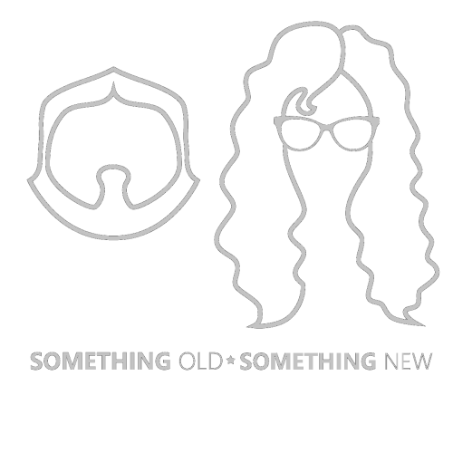

# Data Exposed
## Something Old, Something New (http://aka.ms/sosn)

This page contains samples, references and other content from the Data Exposed series "Something Old, Something New". You can find all the [Data Exposed Content here](https://microsoft.github.io/dataexposed/).

## Episodes

These are the episode  areas, in reverse order, and any links or content we post from the shows. 

As always, we've got a place to ask questions and chat about what you've learned! Follow the [terms and condidions of our Code of Conduct](https://opensource.microsoft.com/codeofconduct/), and [navigate here to post](https://github.com/microsoft/dataexposed/discussions). Make sure you tag your questions with the episode name and date so we know what you're asking about.

<h3><b>     Episode Two: Reduce, Re-use, Recycle</b></h3> 

*[Date Aired: February 24th, 2021](https://youtu.be/TRNvuD5n8BQ)*

TBD

**References:**

- General:
	- [Great overall resource on math and Data Science, with links to training locations](https://www.kdnuggets.com/2018/09/essential-math-data-science.html?s=03) 
	- [T-Test - How to use Python to Perform a Paired Sample T-test (marsja.se)](https://www.marsja.se/how-to-use-python-to-perform-a-paired-sample-t-test/)
	- [Overview of Dimensionality Reduction in Machine Learning](https://medium.com/@rinu.gour123/dimensionality-reduction-in-machine-learning-dad03dd46a9e)
		
- EDA: 
	- [We are in this phase of the Team Data Science Process](https://docs.microsoft.com/en-us/azure/machine-learning/team-data-science-process/lifecycle-data)
	- [General Overview of EDA](https://towardsdatascience.com/exploratory-data-analysis-eda-a-practical-guide-and-template-for-structured-data-abfbf3ee3bd9)
	- [Central Tendency](https://www.c-sharpcorner.com/article/measure-of-central-tendency-in-statistics/)
	- [5 Number Summary](https://www.r-bloggers.com/2013/08/exploratory-data-analysis-the-5-number-summary-two-different-methods-in-r/)
	- [Try EDA on a toy (but real) data set](https://www.analyticsvidhya.com/blog/2021/01/exploratory-data-analysis-on-nyc-taxi-trip-duration-dataset/) 
	- [EDA Example in R](https://r4ds.had.co.nz/exploratory-data-analysis.html) 
	- [Using Python for Data Visualization](https://stackabuse.com/introduction-to-data-visualization-in-python-with-pandas/)
- PCA 
	- [An overview of PCA](https://towardsdatascience.com/5-minute-machine-learning-principal-component-analysis-9bbf83bbfd69)
	- [A practical example in PCA](https://towardsdatascience.com/how-to-remove-multicollinearity-in-dataset-using-pca-4b4561c28d0b) 
	- [A step by step walkthrough of PCA](https://builtin.com/data-science/step-step-explanation-principal-component-analysis)
	- [Python PCA tutorial](https://www.dezyre.com/data-science-in-python-tutorial/principal-component-analysis-tutorial)
- LDA
	- [Topic Modeling and Latent Dirichlet Allocation (LDA) in Python](https://datascience.eu/computer-programming/topic-modeling-and-latent-dirichlet-allocation-lda-in-python/)  
- GDA
    - [Gaussian Discriminant Analysis Overview](https://origin.geeksforgeeks.org/gaussian-discriminant-analysis/)
- Code samples from episode
    - [EDA in R and with Azure SQL Database](https://github.com/microsoft/dataexposed/blob/main/notebooks/SOSNEP02RS01.R)
    - [Anscombe's Quartet Python notebook](https://github.com/microsoft/dataexposed/blob/main/notebooks/SOSNEP02NB01.ipynb)
    - [PCA Example Python notebook](https://github.com/microsoft/dataexposed/blob/main/notebooks/SOSNEP02NB02.ipynb)

<h3><b>     Episode One: Two Data Scientists Walk into a Bar</b></h3> 
 

*[Date Aired: January 20, 2021](https://youtu.be/vl-XtjWTffw?list=PL3EZ3A8mHh0xEjDPcaWeQCjs727PRqA3i)*

In this exciting episode, Buck and Anna introduce the show, and explain the deep and dark meaning behind the show's intriguing title. You'll learn the maths behind Data Science and Machine Learning, why you might want to learn more about them, and then Anna explains a dead-simple way to tell if she wants more coffee.

Probably.

**Something Old:**

- General:
	- [Core Data Science Concepts for Beginners](https://www.kdnuggets.com/2020/12/20-core-data-science-concepts-beginners.html)
    - [How Much Math Do You Actually Need For Data Science?](https://towardsdatascience.com/how-much-math-do-you-actually-need-for-data-science-87a8765ae1f2) 
	- [The Math Behind Machine Learning](https://www.datasciencecentral.com/profiles/blogs/the-math-behind-machine-learning)
    - [Lost Islamic Maths](https://www.bbc.com/future/article/20201204-lost-islamic-library-maths)
    - [Microsoft Research Book on Math and Machine Learning](https://www.datasciencecentral.com/profiles/blogs/new-book-foundations-of-data-science-from-microsoft-research-lab?s=03)
    - [A Personal Journey into Bayesian Networks](https://ftp.cs.ucla.edu/pub/stat_ser/r476.pdf)  
    - [100+ Free Books on Data Science](https://www.theinsaneapp.com/2020/12/free-data-science-books-pdf.html?utm_content=151207683)

- Statistics	
	- [History of Statistics](https://en.wikipedia.org/wiki/History_of_statistics#:~:text=not%20present%20%20%20Continuous%20data%20%20,Biplot%20Box%20plot%20Control%20chart%20%20...)
	- [Statistics and machine learning: what’s the difference?](https://algorithmia.com/blog/statistics-and-machine-learning-whats-the-difference#:~:text=%20What%20are%20the%20key%20differences%20between%20statistics,the%20large%20number%20of%20variables%20in...%20More)
    - [Beginner guides to learning Statistics for Data Science](https://elitedatascience.com/learn-statistics-for-data-science#:~:text=%20The%20Best%20Way%20to%20Learn%20to%20Statistics,3:%20Intro%20to%20Statistical%20Machine%20Learning%20More)
    - [Book references for Statistics and Machine Learning](https://www.kdnuggets.com/2020/12/5-free-books-learn-statistics-data-science.html)

- Algebra
	- [5 Reasons to Learn Linear Algebra for Machine Learning](https://machinelearningmastery.com/linear-algebra-machine-learning/#:~:text=%205%20Reasons%20To%20Improve%20Your%20Linear%20Algebra,of%20the%20algorithm%20and%20its%20constraints...%20More)
	- [Learn Linear Algebra in Five Hours Today with the Wolfram Language](https://blog.wolfram.com/2020/08/14/learn-linear-algebra-in-five-hours-today-with-the-wolfram-language/)
	- [Linear Algebra for Machine Learning](https://the-learning-machine.com/article/machine-learning/linear-algebra)
	- [A gentle approach to Linear Algebra and Machine Learning](https://www.datasciencecentral.com/profiles/blogs/new-approach-to-linear-algebra-in-machine-learning)
    - [A Complete Linear Algebra Tutorial in Python](https://github.com/MacroAnalyst/Linear_Algebra_With_Python)
    
- Calculus
    - [Need a refresher in Calculus? There's a great resource you can use here](https://www.mathsisfun.com/calculus/index.html)
    - [Essential Math for Data Science: Integrals And Area Under The Curve](https://www.kdnuggets.com/2020/11/essential-math-data-science-integrals-area-under-curve.html)
    - [Calculus in Machine Learning](https://medium.com/towards-artificial-intelligence/calculus-in-machine-learning-2e7cddafa21f#id_token=eyJhbGciOiJSUzI1NiIsImtpZCI6IjI1MmZjYjk3ZGY1YjZiNGY2ZDFhODg1ZjFlNjNkYzRhOWNkMjMwYzUiLCJ0eXAiOiJKV1QifQ.eyJpc3MiOiJodHRwczovL2FjY291bnRzLmdvb2dsZS5jb20iLCJuYmYiOjE2MTAwMjA4NTMsImF1ZCI6IjIxNjI5NjAzNTgzNC1rMWs2cWUwNjBzMnRwMmEyamFtNGxqZGNtczAwc3R0Zy5hcHBzLmdvb2dsZXVzZXJjb250ZW50LmNvbSIsInN1YiI6IjEwMjI2Mjg4NjY5NjkwMDU3OTk1MyIsImVtYWlsIjoic2VhdHRsZWhhc2NvZmZlZUBnbWFpbC5jb20iLCJlbWFpbF92ZXJpZmllZCI6dHJ1ZSwiYXpwIjoiMjE2Mjk2MDM1ODM0LWsxazZxZTA2MHMydHAyYTJqYW00bGpkY21zMDBzdHRnLmFwcHMuZ29vZ2xldXNlcmNvbnRlbnQuY29tIiwibmFtZSI6IkJ1Y2sgV29vZHkiLCJwaWN0dXJlIjoiaHR0cHM6Ly9saDMuZ29vZ2xldXNlcmNvbnRlbnQuY29tL2EtL0FPaDE0R2dCUk0yRzM0SGxHWkJ4QjVTRGhKU3ZxeXBrd0JnN19UWks3TVhYOWc9czk2LWMiLCJnaXZlbl9uYW1lIjoiQnVjayIsImZhbWlseV9uYW1lIjoiV29vZHkiLCJpYXQiOjE2MTAwMjExNTMsImV4cCI6MTYxMDAyNDc1MywianRpIjoiZjQ1NTUxMDQ5YTNmZjVkMDE2ODQyN2ZiMWQ3YzU1Y2U4MjA1ZDRmMCJ9.LyhgATruFwb8apRZInefq_Oc14wlSKJJhYsiSS-KXuL_iyz3yEX1RxOSKNqh9h1Sq2E-lyAtIo_EbfkOlCVZqVlIr29bG31ZBExuw9fr9q4xXuGUUndIWAJ3MrHS3Ws5HyNQHzWRfZVGFrZqqfJVIKPqSeZwQfmGizWCkKdRDinDBqTUEcwGnTeyfHH5qmVYOwfVkMeT5R73j8mGjdAzoG03tONvXq3bwgI8hUC2AeKmvhXGAgvug7-_Vnq3XYRk40QdTjamt7fPspv5pGlXJ1ocDdNQYjExydsHSrWZybyo3EfWJIIGsMmJdspGHZNXnZuhOmAfFXGb01Vr09_SmA)

**Something New:**

- Process
    - [Team Data Science Process (TDSP)](http://aka.ms/tdsp)
    - [Cross-industry standard process for data mining (CRISP-DM)](https://en.wikipedia.org/wiki/Cross-industry_standard_process_for_data_mining)
- Algorithms
    - [Algorithm families for Machine Learning](https://machinelearningmastery.com/start-here/#algorithms)
    - [Azure Machine Learning Cheat Sheet for selecting algorithms](https://docs.microsoft.com/en-us/azure/machine-learning/how-to-select-algorithms)
- Example
    - [Coffee use case for Markov Chains](https://github.com/microsoft/dataexposed/blob/main/notebooks/SOSNEP01NB01.ipynb)
